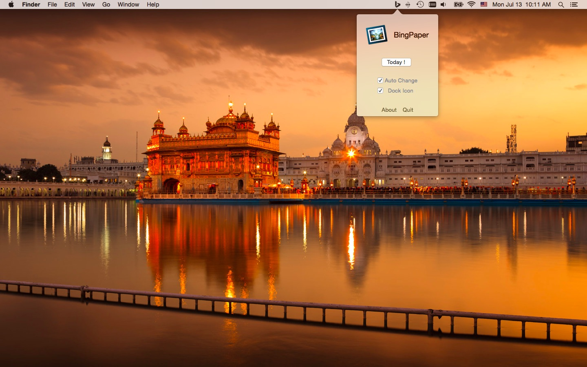
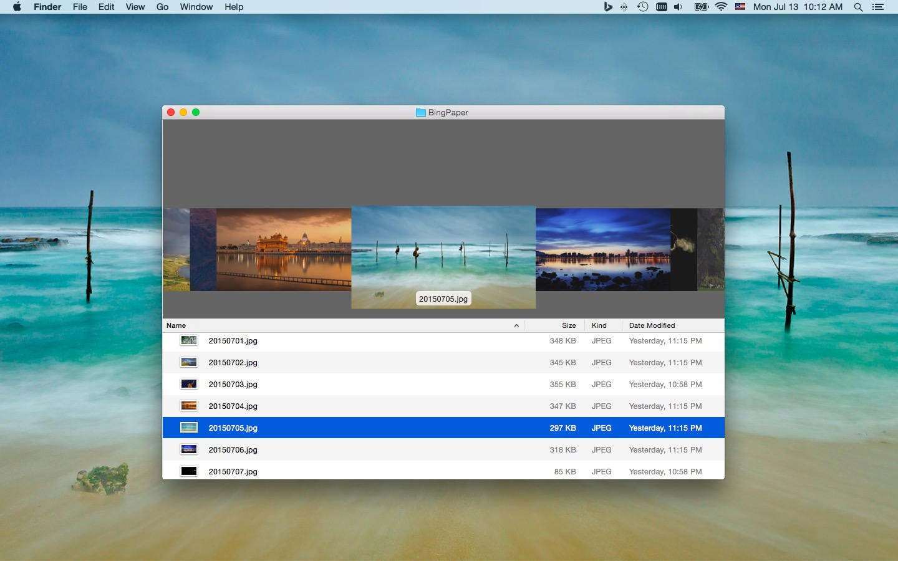
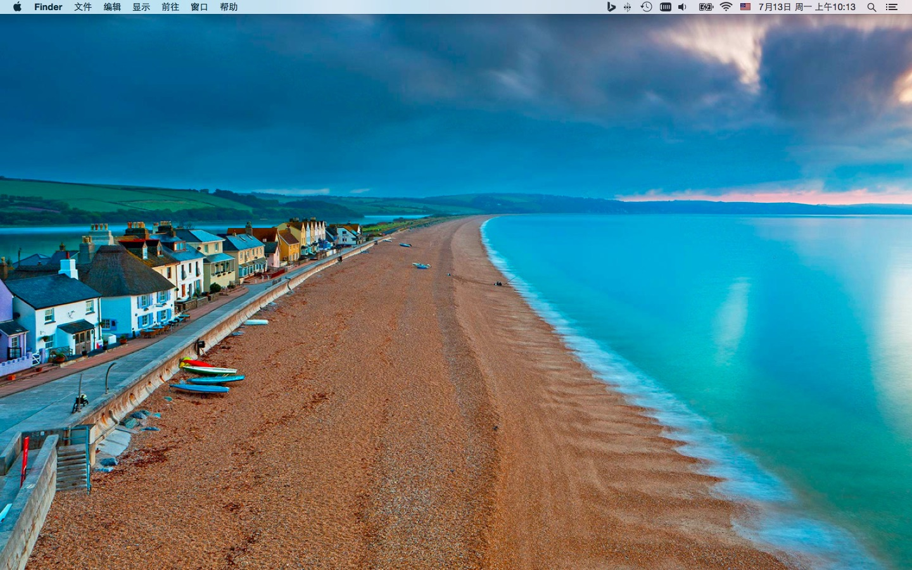
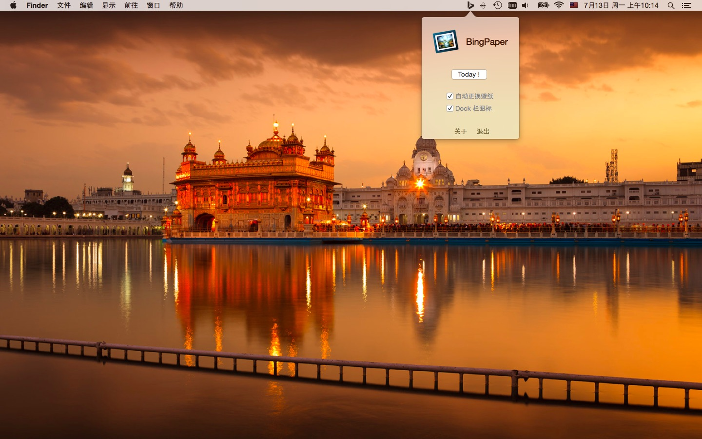
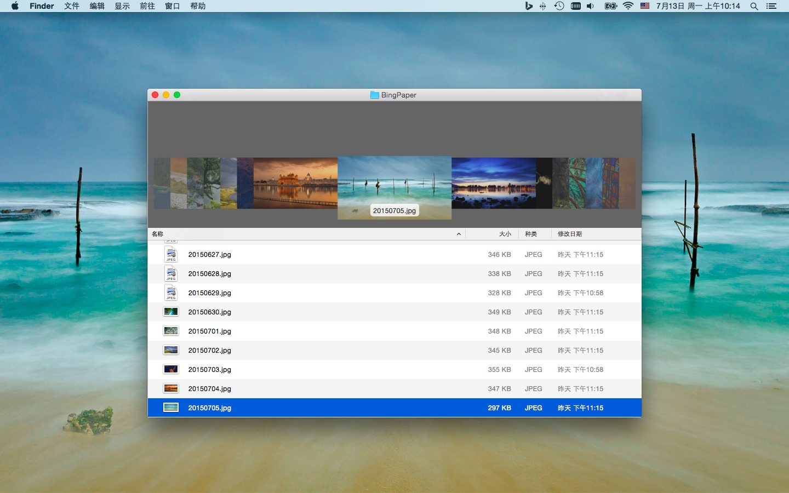

BingPaper
=========
Use Bing daily photo as your wallpaper on Mac OS X.

Features:  
    - Download and save Bing pictures to ~/Pictures/BingPaper  
    - Set new picture as wallpaper automatically  
    - Hide/Show Dock icon  

Feel free to give feedback or contribute to this project.

Version 0.7
-----------

LICENSE
-------
The GPL License. Read [GNU General Public License](http://www.gnu.org/licenses/gpl.html) for further information.
