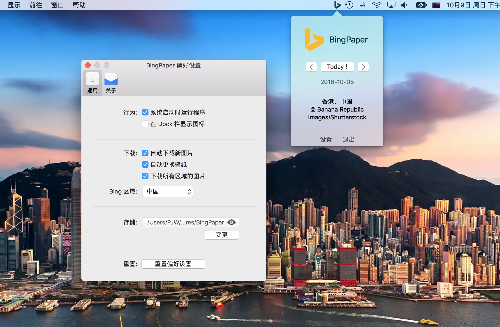

# BingPaper

Use Bing daily photo as your wallpaper on Mac OS X.

## Screenshots

####Version 0.9




## Features

- Auto launch on system startup 
- Hide/Show Dock icon
- Auto download new Bing images
- Auto download images of all regions
- Auto change wallpaper
- Switch Bing region
- Storage the Bing images
- Select a storage place for these images
- Use history images as wallpaper
- Display the Bing image information

Feel free to give feedback or contribute to this project.

## Usage

### Download the Application

You can download the application directly from the [releases tab](https://github.com/prettyxw/BingPaper/releases), and put the `BingPaper.app` application in to your `/Applications` folder.

I did't signed the released application, so you have to disable the gatekeeper on your mac to run it.

### Build from Source

Also can you build the application from source code.

___Download or clone the project___

``` bash
$ git clone git@github.com:prettyxw/BingPaper.git
```

___Install the dependences___

[CocoaPods](https://cocoapods.org) was used to manage the project dependences.

``` bash
$ pod install
```

___Build and run___

Finally, just hit `⌘ + R` to run the application or `⌘ + B` to build the application, and you can drag the built app into your `/Applications` folder.

## LICENSE

The GPL License Version 3.0. Read [GNU General Public License Version 3.0](https://www.gnu.org/licenses/gpl-3.0.en.html) for further information.
